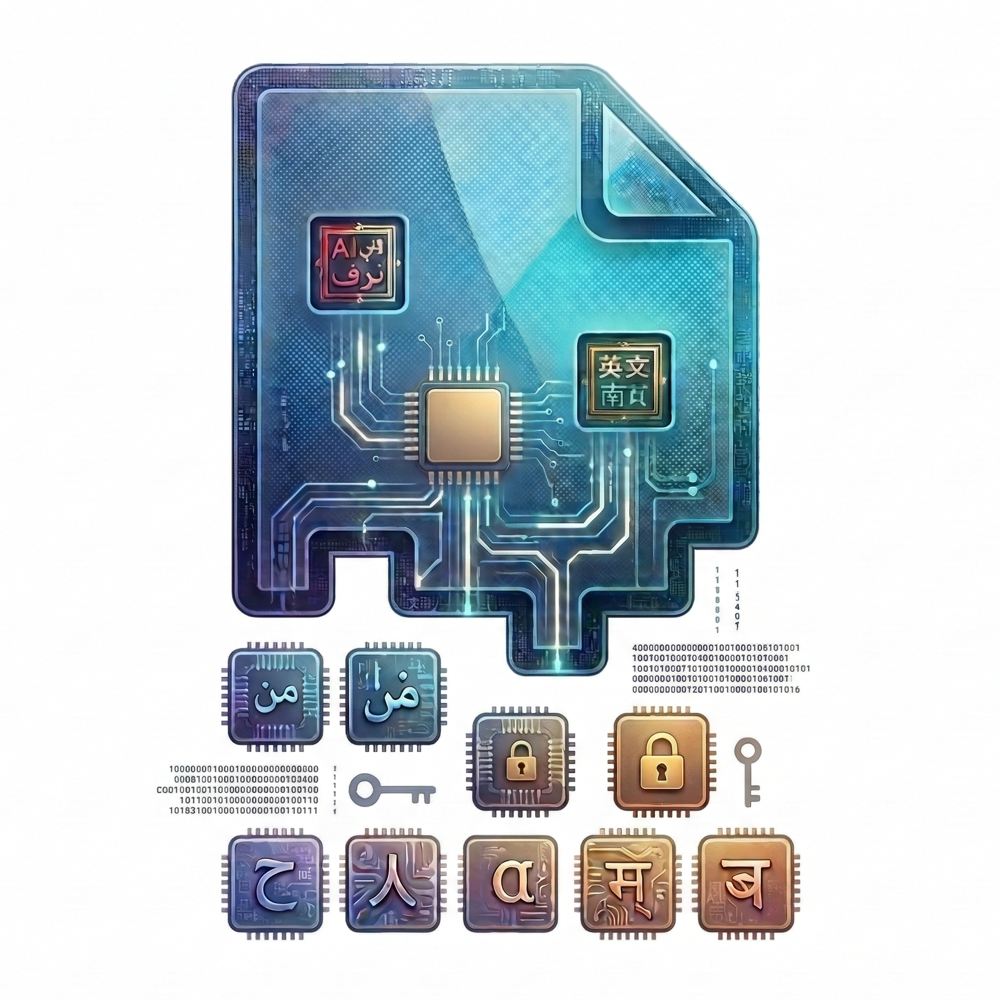

<div align="center">
  
  <h1>LinguaSteg</h1>
</div>

<div align="center">

[](LICENSE)
[](https://github.com/madebydaniz/linguasteg/releases/latest)
[](https://github.com/madebydaniz/linguasteg/actions/workflows/ci-main-gate.yml)
[](https://github.com/madebydaniz/linguasteg/actions/workflows/release-binaries.yml)

Multilingual linguistic steganography CLI in Rust.

Encode secret-protected payloads into natural-language cover text and decode them back deterministically.
</div>

## Installation/Update

### Homebrew

```bash
brew tap madebydaniz/tap
brew install lsteg
```

Update:

```bash
brew update
brew upgrade lsteg
```

### Install script (GitHub Release assets)

```bash
curl -fsSL https://raw.githubusercontent.com/madebydaniz/linguasteg/main/scripts/install.sh | bash
```

Install a specific version:

```bash
curl -fsSL https://raw.githubusercontent.com/madebydaniz/linguasteg/main/scripts/install.sh | bash -s -- --version v0.1.0
```

Note:
- Script checksum verification is always enabled.
- Signature verification uses Cosign keyless by default.
- To skip signature verification (not recommended): `--no-verify-signature`

### Build from source

```bash
git clone https://github.com/madebydaniz/linguasteg.git
cd linguasteg
cargo install --path linguasteg-cli --locked
```

## Usage

### Quick start

```bash
# Install dataset
lsteg data install --lang en --download --format json

# Encode
lsteg encode --lang en --message "hello world" --secret "test-secret" --format text

# Decode
lsteg decode --lang auto --text-input --trace "<stego text>" --secret "test-secret" --format json
```

### Main commands

| Command | Example |
|---|---|
| `encode` | `lsteg encode --lang fa --message "salam" --secret "k"` |
| `decode` | `lsteg decode --lang auto --text-input --trace "..." --secret "k"` |
| `analyze` | `lsteg analyze --lang auto --text-input --trace "..." --format json` |
| `validate` | `lsteg validate --lang auto --trace-input --trace "..."` |
| `catalog` | `lsteg catalog --format json` |
| `templates` / `profiles` / `schemas` | `lsteg templates --lang de` |
| `data install` | `lsteg data install --lang all --download` |
| `data list` | `lsteg data install --lang en --source list --format json` |
| `data status` | `lsteg data status --format json` |
| `data update` | `lsteg data update --lang it --download` |
| `data verify` | `lsteg data verify --lang en --source en-wordnet-princeton` |

## Supported Languages

| Code | Language | Direction |
|---|---|---|
| `fa` | Farsi | `rtl` |
| `en` | English | `ltr` |
| `de` | German | `ltr` |
| `it` | Italian | `ltr` |

MIT License.
